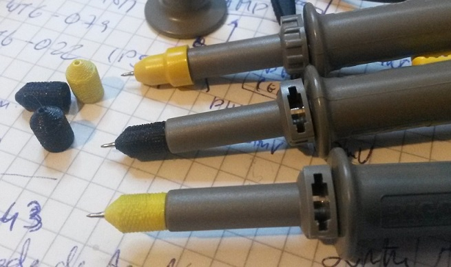
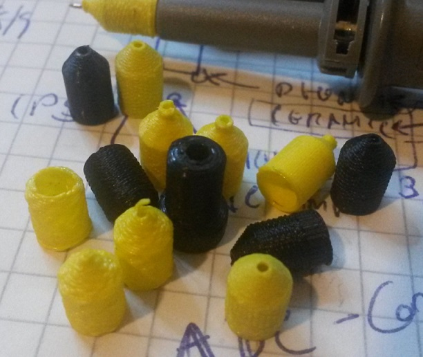

# 3D Printable Electronics Related Stuff

I'll be gathering here a set os electronics related 3D printed stuff of my own design.

## 3D Printable Oscilloscope Probe Tip Cover

OpenSCAD implementation of parametric tip cover for scope probes. This is an accessory usually bundled with probes, but they're tiny and prone to be lost and, above all and in my experience, they have a section with larger diameter than the probe, which makes the set a little bit too bulky for some tight spaces (exactly where you're compelled to use a cover).

There's one (OpenSCAD) module to build the cover, ProbeTipProtection(), in ProbeTipProtectLib.scad . Then there are other files with names specific to the probe in question (there are several size probes), which invoke ProbeTipProtection() with appropriate parameters.

The STL output files for 2 protector models (with and without a metal tip long sleeve) are included, for Rigol's RP2200 probes, ready to be sliced and printed.

In the image below we have at the top the original cover and a few of the covers without the long metal tip sleeve.

Product development is a set of think - design - print - test iterations.

## Printing Guidelines

I print with no supports, 0.4mm nozzle, "spiral" mode. On some slicers it helps to set the number of bottom and top layers to 0.
Printing parameters depend alot on your slicer, printer and filament. In my tests I have used Slic3r (Ultimakercura 4.6 didn't slice the long sleeve version correctly), Creality Ender 3 Pro and [Tucab's Fil3D PLA 4032D](https://www.tucab.pt/en/Fil-3D/Filamentos-3D-PLA) filament.

Before the first use, insert the probe's metal tip into the cover's hole from the outside, to finish the hole opening and line it up. Otherwise you risk rupturing the cover. Also make sure your probe's metal tip is straight, it must line up with the cover's hole.

Enjoy :)
